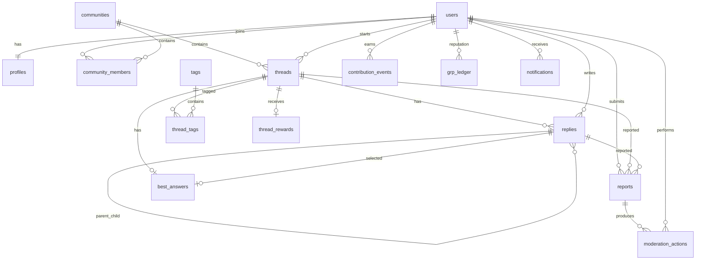

# SAWALA — ERD

## 1. Core ERD



---

## 2. Main Tables

### users
Identity and account status.

### profiles
Public profile information.

### communities
Community metadata and configuration.

### community_members
Membership and role.

### threads
Thread Starter, content, status, quality state.

### replies
Thread replies with nested parent support.

### tags
Reusable topic tags.

### thread_tags
Many-to-many relation.

### contribution_events
Immutable contribution accounting.

### grp_ledger
Immutable GRP accounting.

### reports
User reports.

### moderation_actions
Moderator decisions.

### thread_rewards
TS reward records.

### best_answers
Accepted answer relation.

### notifications
User notifications.

---

## 3. Recommended Indexes

High-priority indexes:

```text
threads(community_id, status, created_at desc)
threads(author_id, created_at desc)
threads(created_at desc)
replies(thread_id, created_at)
replies(author_id, created_at desc)
community_members(community_id, user_id)
community_members(user_id, created_at desc)
contribution_events(user_id, created_at desc)
grp_ledger(recipient_id, created_at desc)
reports(status, created_at)
notifications(user_id, read_at, created_at desc)
```

---

## 4. Important Constraints

- one username per user
- one profile per user
- one membership per user/community
- one Best Answer per thread
- one Thread Reward per thread per reward version
- GRP ledger must be append-only
- moderation actions must reference actor and reason
- deleted content must not destroy audit history
